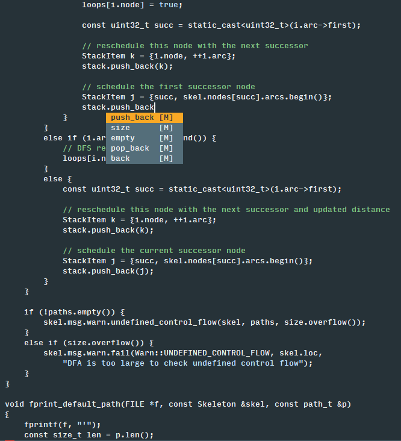
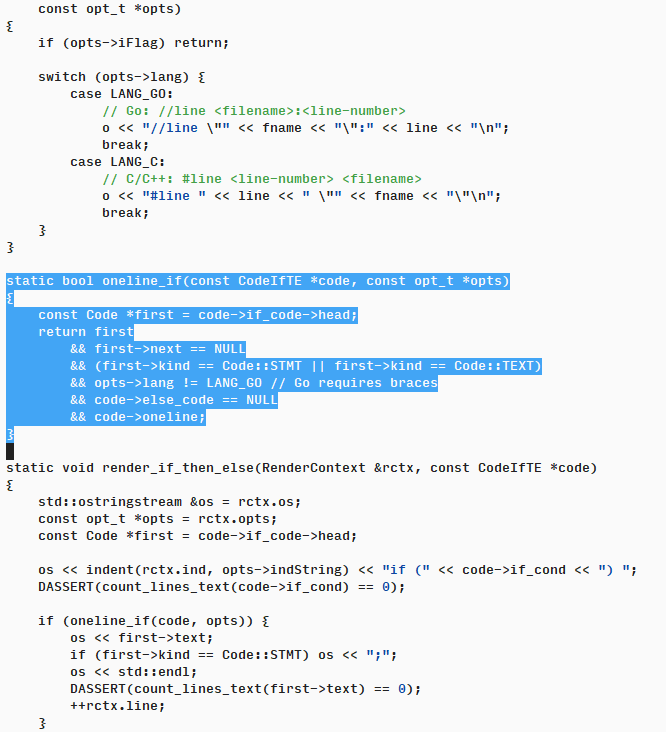

# Freedom Colour Scheme

A restrained colour scheme for Vim. Based on the Material Design colour system with only the absolute minimum of functional colouration.

* See your code as a continuous textual story without navigating colour changes
* Colour schemes that are gentle on the eye whilst still providing contrast
* Comments stand out
* Strings, escape codes and constants are subtly defined to highlight errors

Dark and light variants (but termguicolors only).

Also available for [Sublime Text](https://github.com/frithrah/freedom-sublime).
